# LottoFun - Lottery Management System

## Table of Contents
- [Overview](#overview)
- [Architecture & Design](#architecture--design)
- [Domain Model Design](#domain-model-design)
- [API Specification](#api-specification)
- [Authorization & Authentication](#authorization--authentication)
- [Draw Logic & Prize Distribution](#draw-logic--prize-distribution)
- [Installation & Setup](#installation--setup)
- [Docker Deployment](#docker-deployment)
- [Testing](#testing)
- [Database Schema](#database-schema)
- [Postman Collection](#postman-collection)
- [Future Improvements](#future-improvements)

## Overview

LottoFun is a comprehensive lottery management system built with **Spring Boot 3.5.3** and **PostgreSQL**. The system provides a complete lottery experience including user registration, ticket purchasing, automated draw execution, and prize distribution.

### Key Features
- 🔐 **JWT-based Authentication & Authorization**
- 🎫 **Ticket Purchase System** with number selection (1-49, choose 5)
- 🎲 **Automated Draw Execution** with scheduled tasks
- 🏆 **Prize Calculation** with multiple prize tiers
- 👥 **User Management** with balance tracking
- 📊 **Draw History** and winner tracking
- 🔄 **Real-time Draw Status** updates
- 🔒 **Idempotency Control** prevents duplicate ticket purchases for same user


### Technology Stack
- **Backend**: Spring Boot 3.5.3, Java 17
- **Database**: PostgreSQL 17
- **Security**: Spring Security 6.1.3, JWT (jjwt 0.11.5)
- **Build Tool**: Maven
- **Containerization**: Docker & Docker Compose
- **Testing**: JUnit 5, Mockito
- **Documentation**: Postman Collection

## Architecture & Design

### High-Level Architecture

LottoFun implements a **JWT-based stateless authentication system** with role-based access control.


```mermaid
graph TB
    subgraph "🌐 Client Applications"
        A1["💻 Web Client"]
        A2["📱 Mobile App"]
        A3["🔧 API Testing"]
    end
    
    subgraph "🎯 REST API Layer"
        B1["🔐 Auth API"]
        B2["🎲 Draw API"]
        B3["🎫 Ticket API"]
        B4["👤 User API"]
    end
    
    subgraph "🛡️ Security & Middleware"
        S1["🔐 JWT Authentication"]
        S2["🔒 Authorization"]
    end
    
    subgraph "💼 Business Services"
        C1["🔐 AuthService"]
        C2["🎲 DrawService"]
        C3["🎫 TicketService"]
        C4["👤 UserService"]
    end
    
    subgraph "⚙️ Supporting Components"
        D1["🏆 Prize Calculator"]
        D2["🎯 Winner Selector"]
        D3["🏭 Draw Factory"]
        D4["⏰ Scheduler"]
    end
    
    subgraph "💾 Data Layer"
        E1["📊 JPA Repositories"]
        E2["🐘 PostgreSQL Database"]
    end
    
    %% Main Flow
    A1 --> B1
    B1 --> S1
    S1 --> C1
    S1 --> C2
    S1 --> C3
    S1 --> C4
    
    %% Business Services to Supporting Components
    C2 --> D1
    C2 --> D2
    C2 --> D3
    C3 --> D1
    
    %% Services to Data Layer
    C1 --> E1
    C2 --> E1
    C3 --> E1
    C4 --> E1
    E1 --> E2
    
    %% Scheduler Connection
    D4 -.-> C2
    
    %% Styling
    classDef clientStyle fill:#e3f2fd,stroke:#1976d2,stroke-width:3px,color:#000
    classDef apiStyle fill:#f3e5f5,stroke:#7b1fa2,stroke-width:3px,color:#000
    classDef securityStyle fill:#fff3e0,stroke:#f57c00,stroke-width:3px,color:#000
    classDef businessStyle fill:#e8f5e8,stroke:#388e3c,stroke-width:3px,color:#000
    classDef supportStyle fill:#fff8e1,stroke:#ffa000,stroke-width:3px,color:#000
    classDef dataStyle fill:#efebe9,stroke:#5d4037,stroke-width:3px,color:#000
    
    class A1,A2,A3 clientStyle
    class B1,B2,B3,B4 apiStyle
    class S1,S2 securityStyle
    class C1,C2,C3,C4 businessStyle
    class D1,D2,D3,D4 supportStyle
    class E1,E2 dataStyle
```

### Design Patterns Used

1. **Strategy Pattern**: For prize calculation and winner selection algorithms
2. **Factory Pattern**: For draw creation and initialization
3. **Repository Pattern**: For data access abstraction
4. **DTO Pattern**: For API request/response handling
5. **Builder Pattern**: For entity construction (via Lombok)

## Domain Model Design

### Core Entities

#### User Entity
```java
@Entity
@Table(name = "app_user")
public class User {
    @Id @GeneratedValue(strategy = GenerationType.IDENTITY)
    private Long id;

    @Column(unique = true, nullable = false)
    private String username;

    @Column(nullable = false)
    private String password;

    @Column(nullable = false)
    private BigDecimal balance = BigDecimal.ZERO;

    @OneToMany(mappedBy = "user", cascade = CascadeType.ALL)
    private List<Ticket> tickets;
}
```

#### Draw Entity
```java
@Entity
public class Draw {
    @Id @GeneratedValue(strategy = GenerationType.IDENTITY)
    private Long id;

    @Column(unique = true, nullable = false)
    private Integer drawNumber;

    @Column(nullable = false)
    private LocalDateTime drawDate;

    @Enumerated(EnumType.STRING)
    private DrawStatus status = DrawStatus.DRAW_OPEN;

    @ElementCollection
    private Set<Integer> winningNumbers;

    @OneToMany(mappedBy = "draw", cascade = CascadeType.ALL)
    private List<Ticket> tickets;
}
```

#### Ticket Entity
```java
@Entity
public class Ticket {
    @Id @GeneratedValue(strategy = GenerationType.IDENTITY)
    private Long id;

    @Column(unique = true)
    private String ticketNumber;

    @ManyToOne(optional = false)
    private User user;

    @ManyToOne(optional = false)
    private Draw draw;

    @ElementCollection
    private Set<Integer> selectedNumbers;

    @Column(nullable = false)
    private LocalDateTime purchaseTime;

    private Integer matchCount;
    private BigDecimal prizeAmount;

    @Enumerated(EnumType.STRING)
    private TicketStatus status = TicketStatus.PENDING;

    @Enumerated(EnumType.STRING)
    private PrizeType prize;
}
```

### Entity Relationships


### Enums

#### DrawStatus
- `DRAW_OPEN`: Draw is accepting ticket purchases
- `DRAW_CLOSED`: Draw closed, no more tickets accepted
- `DRAW_EXTRACTED`: Winning numbers generated
- `PAYMENTS_PROCESSING`: Prize distribution in progress
- `DRAW_FINALIZED`: Draw completed

#### TicketStatus
- `PENDING`: Awaiting draw results
- `WON`: Ticket won a prize
- `NOT_WON`: Ticket didn't win

#### PrizeType
- `NO_PRIZE`: No matching numbers
- `LOW`: 2 matches - 100 TL
- `MEDIUM`: 3 matches - 1,000 TL
- `HIGH`: 4 matches - 10,000 TL
- `JACKPOT`: 5 matches - 1,000,000 TL

## API Specification

### Authentication Endpoints

#### POST /api/auth/register
Register a new user account.

**Request:**
```json
{
  "username": "newuser",
  "password": "password123"
}
```

**Response:**
```json
{
  "success": true,
  "message": "User registered successfully",
  "data": {
    "id": 1,
    "username": "newuser",
    "balance": 0,
    "token": null
  }
}
```

#### POST /api/auth/login
Authenticate user and get JWT token.

**Request:**
```json
{
  "username": "existinguser",
  "password": "password123"
}
```

**Response:**
```json
{
  "success": true,
  "message": "Login successful",
  "data": {
    "id": 1,
    "username": "existinguser",
    "balance": 100.00,
    "tickets": null,
    "token": "eyJhbGciOiJIUzI1NiJ9..."

  }
}
```

### Draw Endpoints

#### GET /api/draws
Get all draws.

**Response:**
```json
{
  "success": true,
  "message": "All draws retrieved",
  "data": [
    {
      "id": 1,
      "drawNumber": 1,
      "drawDate": "2024-01-15T20:00:00",
      "status": "DRAW_FINALIZED",
      "ticketCount": 0,
      "winningNumbers": [7, 14, 21, 35, 42]
    }
  ]
}
```

#### GET /api/draws/{drawNumber}
Get specific draw by number.

#### GET /api/draws/active
Get currently active draw.

#### GET /api/draws/history
Get completed draws with results.

### Ticket Endpoints

#### POST /api/tickets/users/{userId}/purchase
Purchase a ticket for the active draw with **idempotency control**.

**Idempotency Feature:**
The system prevents duplicate ticket purchases by implementing idempotency control. If a user attempts to purchase a ticket with the same numbers for the same active draw, the system returns the existing ticket instead of creating a duplicate.

**Request:**
```json
{
  "numbers": [7, 3, 45, 14, 47]
}
```

**Response (New Ticket):**
```json
{
  "success": true,
  "message": "Ticket purchased successfully",
  "data": {
    "ticketId": 16,
    "drawNumber": 16,
    "selectedNumbers": [
      7,
      13,
      45,
      14,
      47
    ],
    "purchaseTime": "2025-07-13T14:55:42.557992",
    "prizeAmount": null,
    "status": "PENDING",
    "ticketNumber": "hozaydin-16-1752407742553",
    "winningNumbers": [],
    "matchCount": 0,
    "drawStatus": "DRAW_OPEN",
    "username": "hozaydin"
  }
}
```

**Response (Existing Ticket - Idempotency):**
```json
{
  "success": true,
  "message": "Ticket already purchased with these numbers; returning existing ticket",
  "data": {
    "ticketId": 16,
    "drawNumber": 16,
    "selectedNumbers": [
      7,
      13,
      45,
      14,
      47
    ],
    "purchaseTime": "2025-07-13T14:55:42.557992",
    "prizeAmount": null,
    "status": "PENDING",
    "ticketNumber": "hozaydin-16-1752407742553",
    "winningNumbers": [],
    "matchCount": 0,
    "drawStatus": "DRAW_OPEN",
    "username": "hozaydin"
  }
}
```

#### GET /api/tickets/users/{userId}
Get all tickets for a specific user.

#### GET /api/tickets/draws/{drawNumber}
Get all tickets for a specific draw.

#### GET /api/tickets/users/{userId}/active-draw
Get user's tickets for the active draw.

#### GET /api/tickets/draws/{drawNumber}/top-winners
Get top winners for a specific draw.

### User Endpoints

#### GET /api/users/{userId}/details
Get user details including balance and ticket history.

## Authorization & Authentication

### Security Architecture

LottoFun implements a **JWT-based stateless authentication system** with role-based access control.

### Authentication Flow

#### 1. **User Registration Process**
- User provides username and password via POST request to `/api/auth/register`
- Password is securely hashed using BCrypt algorithm with automatic salt generation
- User credentials are validated and stored in PostgreSQL database

#### 2. **User Login Process**
- User submits credentials via POST request to `/api/auth/login`
- System validates username and password against database records
- Upon successful authentication, JWT token is generated
- Token is returned along with user profile information
- Client stores token for subsequent API requests

#### **Public Endpoints** (No Authentication Required)
- `POST /api/auth/register` - User registration
- `POST /api/auth/login` - User login
- `GET /api/draws/**` - All draw-related read operations
- `GET /api/tickets/draws/{drawNumber}` - View tickets for specific draw
- `GET /api/tickets/draws/{drawNumber}/top-winners` - View winners

#### **Protected Endpoints** (JWT Token Required)
- `POST /api/tickets/users/{userId}/purchase` - Purchase tickets
- `GET /api/tickets/users/{userId}` - View user's tickets
- `GET /api/tickets/users/{userId}/draws/{drawNumber}` - User's tickets for specific draw
- `GET /api/tickets/users/{userId}/active-draw` - User's active draw tickets
- `GET /api/users/{userId}/details` - User profile and balance

## Draw Logic & Prize Distribution

### Draw Execution Flow


### Winner Selection Strategy

The system uses `DefaultWinnerSelectionStrategy` which:
- Generates 5 unique random numbers between 1-49
- Uses `SecureRandom` for cryptographically secure randomness
- Ensures no duplicate numbers in winning combination

### Prize Calculation Strategy

The `DefaultPrizeCalculationStrategy` implements fixed prize amounts:

| Match Count | Prize Type | Amount (TL) |
|-------------|------------|-------------|
| 5           | JACKPOT    | 1,000,000   |
| 4           | HIGH       | 10,000      |
| 3           | MEDIUM     | 1,000       |
| 2           | LOW        | 100         |
| 0-1         | NO_PRIZE   | 0           |

### Scheduled Draw Execution

- **Frequency**: Every 1 minute (configurable)
- **Scheduler**: Spring's `@Scheduled` annotation
- **Process**: Automatic draw closure, winner selection, and prize distribution
- **Next Draw**: Automatically created after current draw finalization

## Installation & Setup

### Prerequisites
- Java 17 or higher
- Maven 3.6+
- PostgreSQL 17
- Docker & Docker Compose (optional)

### Local Development Setup

1. **Clone the repository:**
```bash
git clone <repository-url>
cd LottoFun
```

2. **Setup PostgreSQL Database:**
```sql
CREATE DATABASE lottofun;
CREATE USER postgres WITH PASSWORD '1234';
GRANT ALL PRIVILEGES ON DATABASE lottofun TO postgres;
```

3. **Configure application.properties:**
```properties
spring.datasource.url=jdbc:postgresql://localhost:5432/lottofun
spring.datasource.username=postgres
spring.datasource.password=1234
```

4. **Build and run the application:**
```bash
./mvnw clean install
./mvnw spring-boot:run
```

5. **Access the application:**
- API Base URL: `http://localhost:8080`

## Docker Deployment

### Using Docker Compose (Recommended)

1. **Build and start services:**
```bash
docker-compose up --build
```

This will:
- Start PostgreSQL container on port 5432
- Build and start the LottoFun application on port 8080
- Create necessary volumes for data persistence

2. **Stop services:**
```bash
docker-compose down
```

3. **Stop and remove volumes:**
```bash
docker-compose down -v
```

### Manual Docker Build

1. **Build the application:**
```bash
./mvnw clean package -DskipTests
```

2. **Build Docker image:**
```bash
docker build -t lotto-app .
```

### Docker Configuration

**Dockerfile:**
```dockerfile
FROM eclipse-temurin:17-jdk-alpine
ARG JAR_FILE=target/*.jar
COPY ${JAR_FILE} app.jar
ENTRYPOINT ["java","-jar","/app.jar"]
```

**docker-compose.yml:**
- PostgreSQL 17 with persistent volume
- Application with Spring profile `docker`
- Automatic dependency management
- Port mapping: 8080 (app), 5432 (db)

## Testing

### Running Tests

```bash
# Run all tests
./mvnw test

# Run specific test class
./mvnw test -Dtest=DrawServiceImplTest
```

### Test Structure
```
src/test/java/
├── LottoFunApplicationTests.java           # Application context test
├── scheduler/
│   └── DrawSchedulerTest.java              # Scheduler testing
└── service/impl/
├── DrawServiceImplTest.java            # Draw service testing
└── TicketServiceImplTest.java          # Ticket service testing
```

### Testing Approach

1. **Unit Tests**: Service layer testing with mocked dependencies
2. **Scheduler Tests**: Cron job execution and timing tests

## Postman Collection

The project includes a comprehensive Postman collection (`lotto-fun.postman_collection.json`) with:

### Collection Structure
```
lotto-fun/
├── auth/
│   ├── register          # User registration
│   ├── login            # User authentication
│   └── user detail      # Get user details
├── tickets/
│   ├── purchase ticket for user     # Buy lottery ticket
│   ├── get all tickets for draw     # Draw tickets
│   ├── get tickets for user         # User tickets
│   ├── get active draw tickets      # Active draw tickets
│   ├── get top winners             # Winners list
│   └── get user tickets by draw    # User-specific draw tickets
└── draws/
    ├── get all draws               # All draws
    ├── get draw by number          # Specific draw
    ├── get active draw             # Current active draw
    └── get draw history            # Completed draws
```

### Environment Variables
```json
{
  "baseUrl": "http://localhost:8080",
  "authToken": "{{generated_jwt_token}}"
}
```

### Import Instructions
1. Open Postman
2. Click "Import" → "File" → Select `lotto-fun.postman_collection.json`
3. Create environment with `baseUrl` variable with it value
4. Create environment with `authToken` variable with no value
4. Run authentication requests to get JWT token
5. Token automatically saved to environment for subsequent requests

## Contact & Support

For questions, issues, or contributions, please contact.

**Email**: ozaydinecee@gmail.com
**Phone Number**: +905466213099

**Project Version**: 1.0  
**Last Updated**: January 2024  
**License**: MIT License 